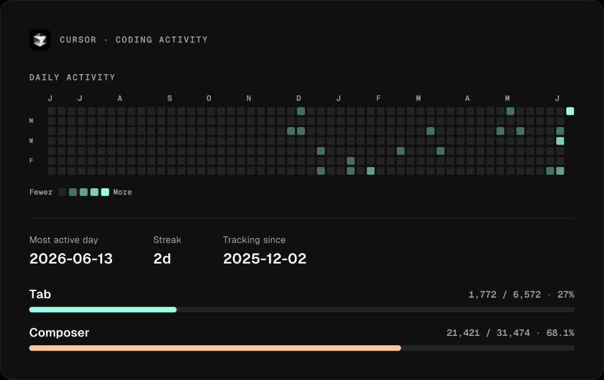

# cursor-stats

Track Cursor tab and composer usage locally, then sync a stats card to your GitHub profile README.



Cursor's dashboard often shows **zero tab completions** even while you are actively using Tab. This is a [confirmed bug](https://forum.cursor.com/t/the-tab-completions-metric-in-the-dashboard-are-consistently-zero/154527) with plenty of related reports where usage tracking simply does not work. I wanted to see tab consumption on my Cursor subscription, got annoyed, and built this instead.

Add it to your [GitHub special repository](https://docs.github.com/en/account-and-profile/setting-up-and-managing-your-github-profile/customizing-your-profile/managing-your-profile-readme) and enjoy.

> [!WARNING]
> I've only tested this on macOS. Haven't tried Linux or Windows, so idk if it works there.

## Install

Requires [Bun](https://bun.sh):

```bash
bun add -g github-cursor-stats
```

## Quick start

1. Create a repo named after your GitHub username (your profile README repo).
2. Clone it locally.
3. Sync stats from Cursor's local database:

```bash
cd your-username
cursor-stats sync
```

4. Commit the generated files, or push in one step:

```bash
cursor-stats sync --push
```

`sync` reads `state.vscdb` from Cursor's app data, writes `stats.json`, `cursor-stats.png`, and injects the card into `README.md` between `<!-- cursor-stats:start -->` and `<!-- cursor-stats:end -->`. Re-run it whenever you want the card updated.

## Options

```bash
cursor-stats sync [options]

  -o, --output-dir <dir>   Output directory (default: cwd)
  -p, --push               Commit and push generated files
  -d, --vscdb <path>       Path to state.vscdb (default: Cursor app data)
      --show-tab <bool>      Show tab usage bar (default: true)
      --show-composer <bool> Show composer usage bar (default: true)
      --color-tab <hex>      Tab bar color
      --color-composer <hex> Composer bar color
      --color-accent <hex>   Heatmap accent color
      --color-bg <hex>       Card background
      --color-text <hex>     Primary text
      --color-muted <hex>    Muted text
```

## Privacy

`cursor-stats` reads your local Cursor database (`state.vscdb`) only. It does not send data anywhere on its own.

When you sync to a GitHub repo, it writes usage stats (tab/composer accepted and suggested line counts by day) and a machine id derived from your hostname, platform, and CPU architecture (for example `my-laptop-darwin-arm64`).

## Development

```bash
bun install
bun dev -- sync
bun test
bun run build
```

## License

MIT. See [LICENSE](LICENSE).

Stats card fonts use [Geist](https://github.com/vercel/geist-font) and Geist Mono under the [SIL Open Font License 1.1](https://openfontlicense.org). See [NOTICE](NOTICE).
